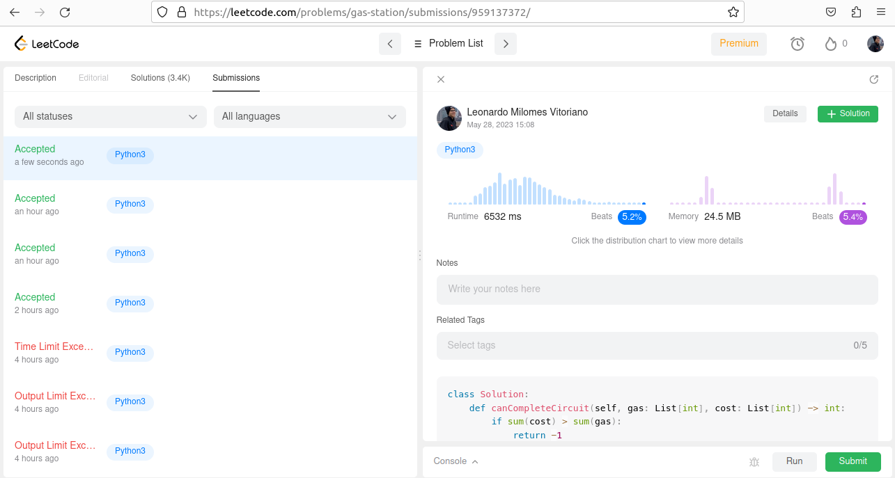
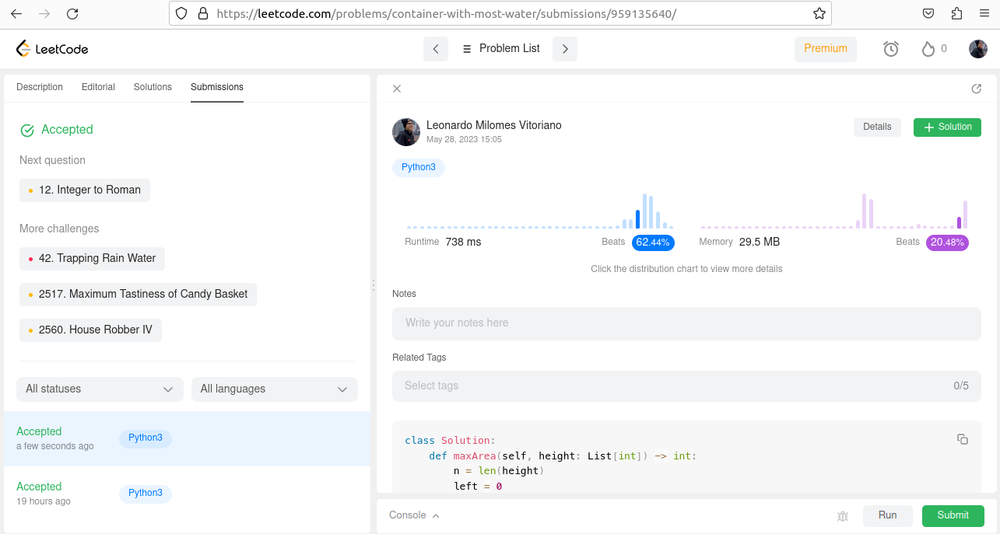

# Gas Station

**Número da Lista**: 20 
**Conteúdo da Disciplina**: Greed 

## Alunos
| Matrícula | Aluno |
| -- | -- |
| 19/0045817  | Gabriel Costa de Oliveira      |
| 20/1000379  |  Leonardo Milomes Vitoriano |

## Sobre 
A dupla decidiu realizar 2 exercícios do [LeetCode](https://leetcode.com/problemset/all/), que é um site com exercícios de programação com juízes online, para praticar o conteúdo de **Algoritmos Ambiciosos**.

Os enunciados dos 2 exercícios podem ser encontrados na listagem abaixo:

- [Gas Station](https://leetcode.com/problems/gas-station/)
- [Container With Most Water](https://leetcode.com/problems/container-with-most-water/description/)

## Screenshots

Na figura 1, encontra-se a submissão aceita do exercício Gas Station:

Figura 1 - Gas Station.

Na figura 2, encontra-se a submissão aceita do exercício Container With Most Water 

Figura 2 - Container With Most Water.

## Instalação 

**Linguagem**: Python3 e C++ 

### Instalação do Python

Para instalar Python3 no **Windows**, siga o tutorial a seguir:
- [Python no Windows](https://www.python.org/downloads/windows/)

Para instalar Python3 no **Linux**, siga o tutorial a seguir:
- [Python no Linux](https://python.org.br/instalacao-linux/)

### Instalação do C++

É necessário ter pré-instalados e configurados na sua máquina:
- [gcc](https://gcc.gnu.org/);

No **Linux**, para instalar o **g++**, execute o seguinte comando:

    sudo apt-get install build-essential

## Uso 

Após instalar as dependências do projeto, realize os seguintes comandos: 

    git clone https://github.com/projeto-de-algoritmos/Greed_GasStation.git
    cd Greed_GasStation

### Uso dos exercícios em Python

Agora o seu ambiente agora está configurado. Para testar os 2 exercícios desenvolvidos em Python, que estão nas pastas nomeados de:
- GasStation
- ContainerWithMostWater

Basta entrar na pasta do exercício e digitar os comandos:

    cd <nomePasta>
    python3 test1.py
    python3 test2.py

Pronto! O código está rodando e os exercícios podem ser testados.

### Uso dos exercícios em C++

Agora o seu ambiente agora está configurado. Entre na pasta no qual deseje testar um exercícios dentre os disponibilizidos. Basta entrar na pasta do exercício e digitar os comandos:

    cd <nomePasta>
    g++ <nomeArquivo>.cpp
    ./a.out < test1.txt
    ./a.out < test2.txt
    ./a.out < test3.txt

Pronto! O código está rodando e os exercícios podem ser testados.

## Vídeo

O vídeo explicando o algoritmo e o funcionamento dele, pode ser encontrado no link a seguir:
- [Vídeo]()

